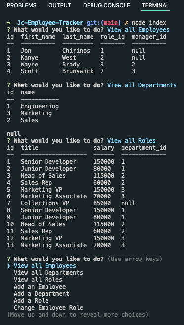

# Employee Tracker

## Description

This program uses node.js to run an app that stores employee data in a mySQL server using Sequelize to communicate GET/Post/Puts routes. These routes are capable of adding/deleting/storing data that can be modified for the users purpose of tracking employee's and departments. The 'db folder' contains the necessary tables and seeding to get your table up and running. Install my program using the commands '$ npm i' & use the '$ node index' to run the program.

## Technologies Used

-   Javascript
-   HTML
-   Node.js
-   mySQL
-   Sequelize
-   npm inquirer

## Screenshot

## Links to Application

-   Here is the repo: [Jon's Portfolio Repo](https://https://github.com/Jonchirinos/Jc-Employee-Tracker)
